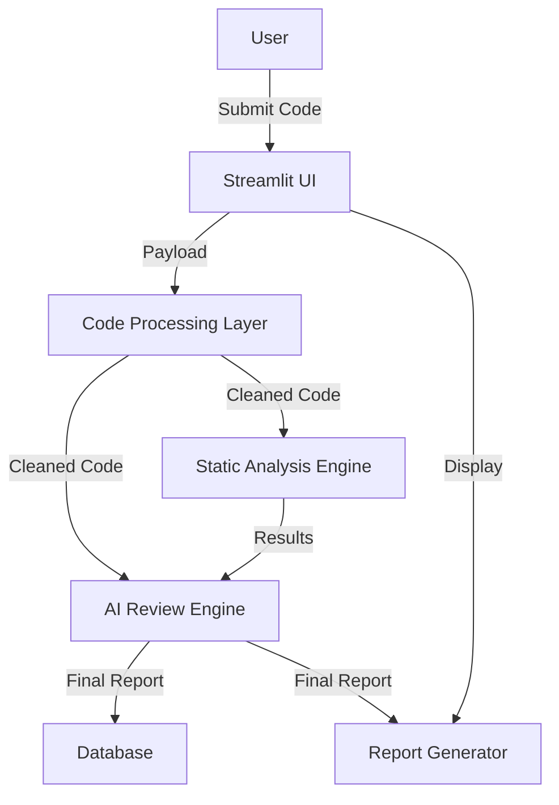

# SYSTEM DESIGN: AI-Powered Automated Code Reviewer

## Problem Statement
Software developers often struggle with maintaining code quality, ensuring security, and adhering to best practices, especially when working in large teams or on legacy codebases. Manual code reviews are time-consuming, inconsistent, and often miss subtle bugs or security vulnerabilities.

## Objectives
- Automate the code review process to provide rapid, consistent feedback.
- Identify bugs, security vulnerabilities, and code-quality issues.
- Provide actionable suggestions and refactored code snippets.
- Support multiple programming languages and input methods.

## Functional Requirements
- Support for multiple code input methods (text, files, zip, GitHub).
- Automated static analysis and AI-based code review.
- Security vulnerability scanning.
- Report generation (PDF, Summary).
- User authentication and history tracking.

## Non-Functional Requirements
- High reliability and accuracy.
- Low latency for review requests.
- Scalability to handle concurrent users.
- Secure handling of code snippets and repository data.

## User Flow
1. User authenticates (Login/Register).
2. User selects input method (Paste, Upload, GitHub).
3. System parses and cleans code.
4. System runs Static Analysis (pylint, bandit, etc.).
5. System runs AI Review Engine.
6. System generates comprehensive report.
7. User reviews results and downloads PDF.

## System Architecture

